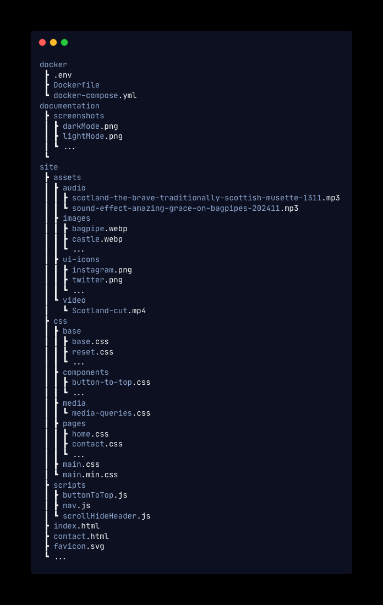
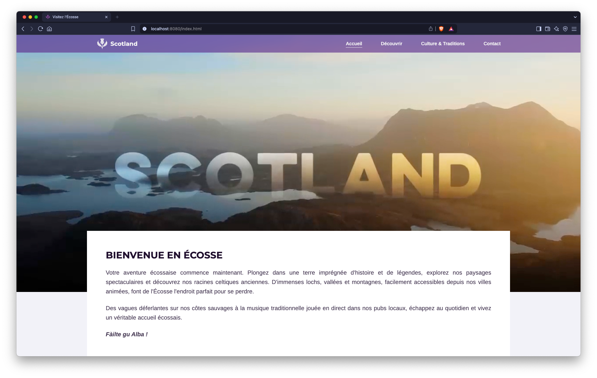
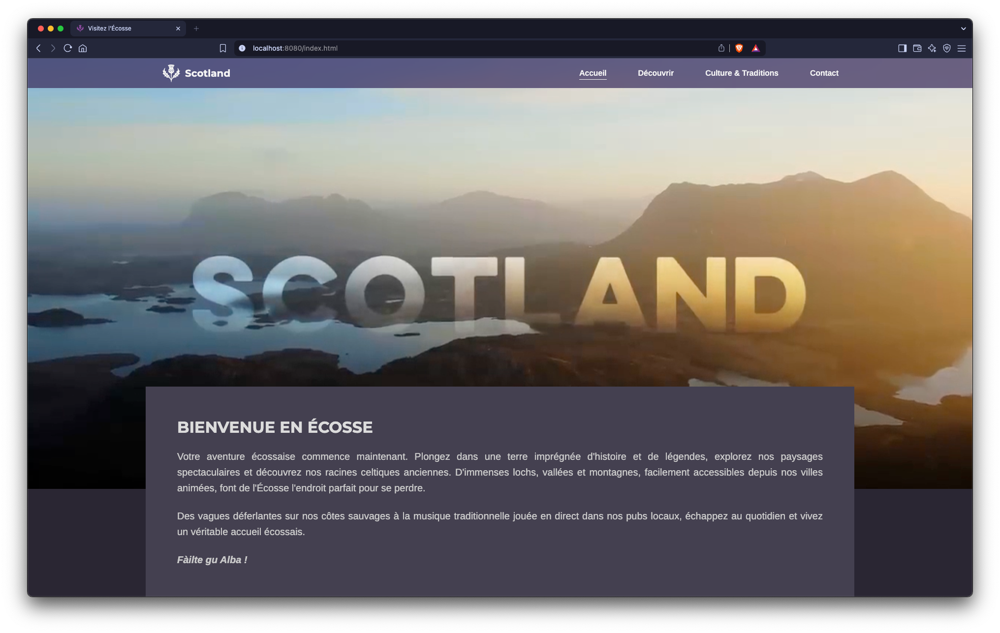
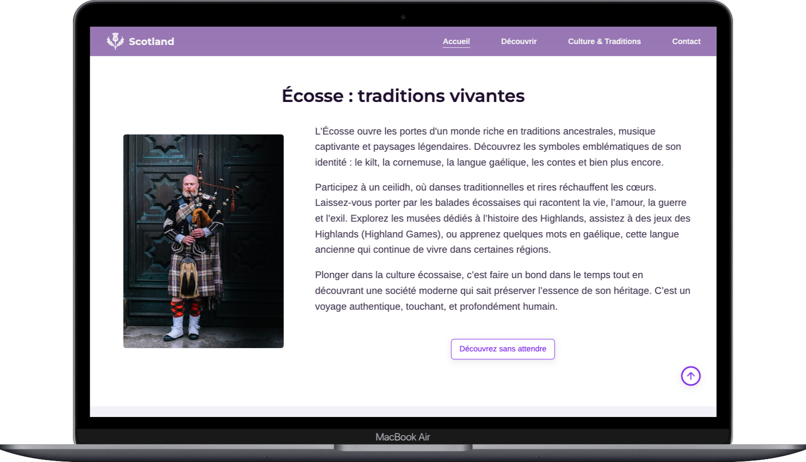
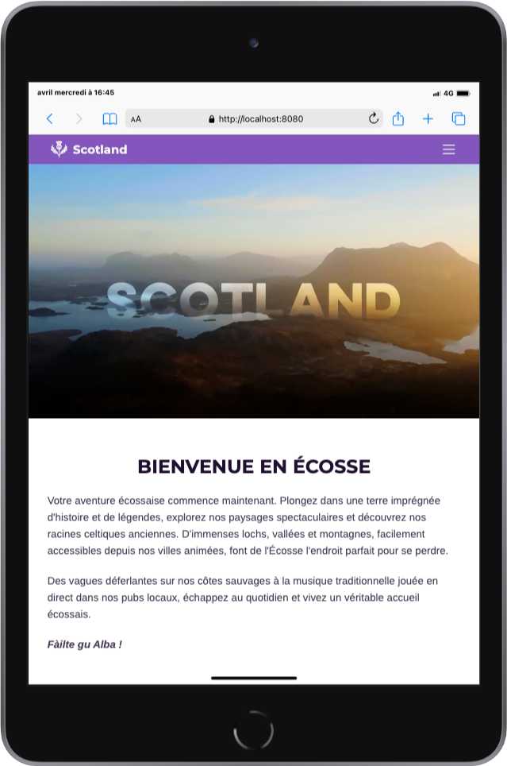
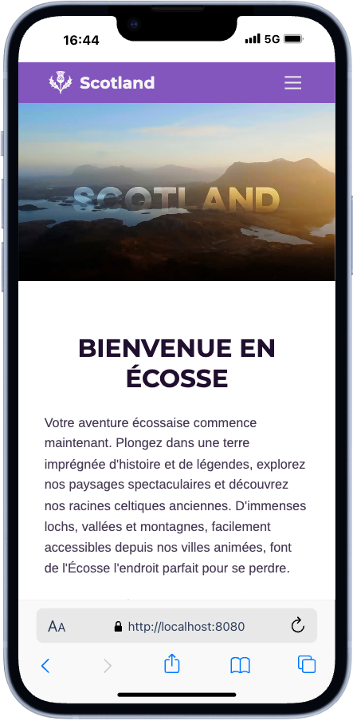

# IPFA BIDA 01 Web Exam

## Project Overview
This project is a responsive static website developed using HTML and CSS as part of the IPFA BIDA 01 exam. It offers an immersive discovery of Scotland through visual and audio content, while ensuring a smooth experience across all screen sizes (desktop, tablet, mobile).

> ⚠️ The design and thematic approach of this project were **inspired by the official website** [visitscotland.com](https://www.visitscotland.com/).  
> I have adapted and simplified it to meet the requirements of this academic evaluation.

---

## Présentation du projet
Ce projet est un mini-site web **statique** et **responsive**, développé en **HTML** et **CSS** dans le cadre de l’examen **IPFA BIDA 01**.

Il propose une **découverte immersive de l’Écosse** à travers des contenus visuels et sonores, tout en garantissant une expérience fluide sur tous les types d’écrans (ordinateurs, tablettes, mobiles).

> ⚠️ Le design et l’approche thématique de ce projet ont été **inspirés du site officiel** [visitscotland.com](https://www.visitscotland.com/).  
> Je l’ai adapté et simplifié afin de répondre aux exigences de cette évaluation académique.

---

<details>
  <summary>🇬🇧 English</summary>

## Table of Contents 
- [Local Deployment with Docker](#local-deployment-with-docker)
- [Site Structure (Navigation)](#site-structure-navigation)
- [Project Structure (Files)](#project-structure-files)
- [Technologies Used](#technologies-used)
- [Learning Objectives](#learning-objectives)
- [Theme Preview](#theme-preview)
- [Responsive Design](#responsive-design)

---

## Local Deployment with Docker
This project uses **Docker** and **docker-compose** to run the static site in a container. This ensures identical execution on all machines without manual server configuration.

### Files Used
- `.env`: Contains environment variables
- `Dockerfile`: Defines the Docker image based on a lightweight web server (**Nginx**)
- `docker-compose.yml`: Orchestrates and launches the container

### Prerequisites
- [Docker Desktop](https://www.docker.com/products/docker-desktop/) installed (or Docker engine on Linux/macOS)
- `docker-compose` (included with Docker Desktop)

### Run the Site Locally
```bash
# Clone the project
git clone https://github.com/CGREGG001/visit-scotland.git
cd visit-scotland/docker

# Build and Start the container
docker-compose up --build
```
The site will be accessible at:  
http://localhost:8080

### To stop the container
```bash
docker-compose down
```

---

## Site Structure (Navigation)
1. **Home** – General introduction to the website and Scotland.  
2. **Discovery** – Enriched content with images and videos of iconic landscapes.  
3. **Culture & Traditions** – Interactive content with audio and descriptions of Scottish customs.  
4. **Contact** – Contact form and useful information.

---

## Project Structure (Files)



---

## Technologies Used
- **HTML** for website structure.  
- **CSS** (Flexbox, Grid, Media Queries) for layout and responsive design.  
- **Nginx**: Web server to handle requests, security, and redirects.  
- **Docker**: Containerizing applications for consistent and repeatable deployment.

---

## Learning Objectives
- Structure a multi-page website using HTML and CSS.  
- Integrate multimedia elements (images, videos, audio).  
- Design a responsive layout for better accessibility.  
- Configure a web server to handle requests, security, and redirects.  
- Containerize applications for consistent and reproducible deployment.

---

## Theme Preview
The website automatically adapts to your system’s theme preference: light if your system is in light mode, dark if it’s in dark mode.  
No action is required from the user — it works seamlessly.

<details>
  <summary>Light Mode</summary>


</details>

<details>
  <summary>Dark Mode</summary>


</details>

---

## Responsive Design
The website is fully responsive and adapts seamlessly to all screen sizes.  
Below are previews on various devices.

<details>
  <summary>Laptop</summary>


</details>

<details>
  <summary>Tablet</summary>


</details>

<details>
  <summary>Mobile</summary>


</details>

</details>

---

## 🇫🇷 Table des matières
- [Déploiement local avec Docker](#déploiement-local-avec-docker)
- [Structure du site](#structure-du-site-navigation)
- [Structure du projet](#structure-du-projet-fichiers)
- [Technologies utilisées](#technologies-utilisées)
- [Objectifs pédagogiques](#objectifs-pédagogiques)
- [Aperçu du thème](#aperçu-du-thème)
- [Design Responsive](#design-responsive)

---

## Déploiement local avec Docker
Ce projet utilise **Docker** et **docker-compose** pour exécuter le site statique dans un conteneur. Cela garantit une exécution identique sur toutes les machines, sans configuration manuelle du serveur.

### Fichiers utilisés
- `.env` : Contient les variables d’environnement
- `Dockerfile` : Définit l’image Docker à partir d’un serveur web léger (**Nginx**)
- `docker-compose.yml` : Orchestration et lancement du conteneur

### Prérequis
- [Docker Desktop](https://www.docker.com/products/docker-desktop/) installé (ou Docker Engine sur Linux/macOS)
- `docker-compose` (inclus avec Docker Desktop)

### Lancer le site en local
```bash
# Cloner le projet
git clone https://github.com/CGREGG001/visit-scotland.git
cd visit-scotland/docker

# Construire et Démarrer le conteneur
docker-compose up --build
```
Le site sera accessible à l’adresse :
http://localhost:8080

### Pour arrêter le conteneur
```bash
docker-compose down
```

---

## Structure du Site (Navigation)
1. **Accueil** – Présentation générale du site et introduction à l’Écosse.
2. **Découverte** – Page enrichie avec images et vidéos des paysages emblématiques.
3. **Culture et traditions** – Contenus interactifs avec audios et descriptions des coutumes écossaises.
4. **Contact** – Formulaire de contact et informations utiles.

---

## Structure du Projet (Fichiers)


---

## Technologies utilisées
- **HTML** pour la structure du site.
- **CSS** (Flexbox, Grid, Media Queries) pour la mise en page et le design responsive.
- **Nginx** : Serveur web pour gérer les requêtes, la sécurité et les redirections.
- **Docker** : Conteneurisation des applications pour un déploiement cohérent et reproductible.

---

## Objectifs pédagogiques
- Structurer un site multi-pages en HTML et CSS.
- Intégrer des éléments multimédias (images, vidéos, audios).
- Concevoir un design adaptatif (responsive) pour une meilleure accessibilité.
- Configurer un serveur web pour gérer les requêtes, la sécurité et les redirections.
- Conteneuriser les applications pour un déploiement cohérent et reproductible.

---

## Aperçu du Thème
Le site s’adapte automatiquement à la préférence de thème de votre système : clair ou sombre.
Aucune action n’est requise de la part de l’utilisateur — tout fonctionne de manière fluide et automatique.

- Mode clair


- Mode sombre


---

## Design Responsive
Le site est entièrement **responsive**, ce qui signifie qu’il s’adapte parfaitement à toutes les tailles d’écran.
Ci-dessous, vous trouverez des aperçus sur différents types d’appareils :

<details>
  <summary>
    Ordinateur portable
  </summary>


</details>

<details>
  <summary>
    Tablette
  </summary>


</details>

<details>
  <summary>
    Mobile
  </summary>


</details>
