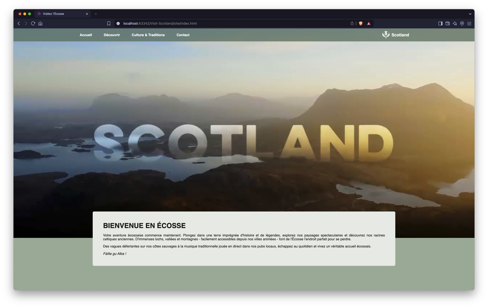
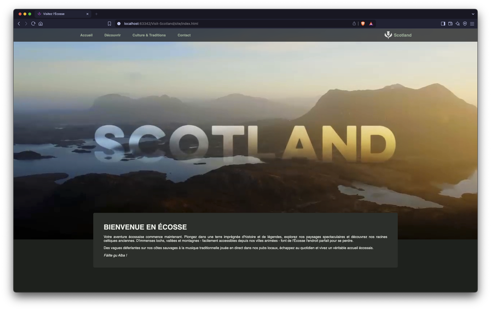
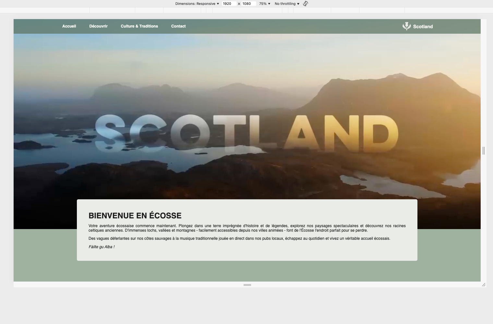
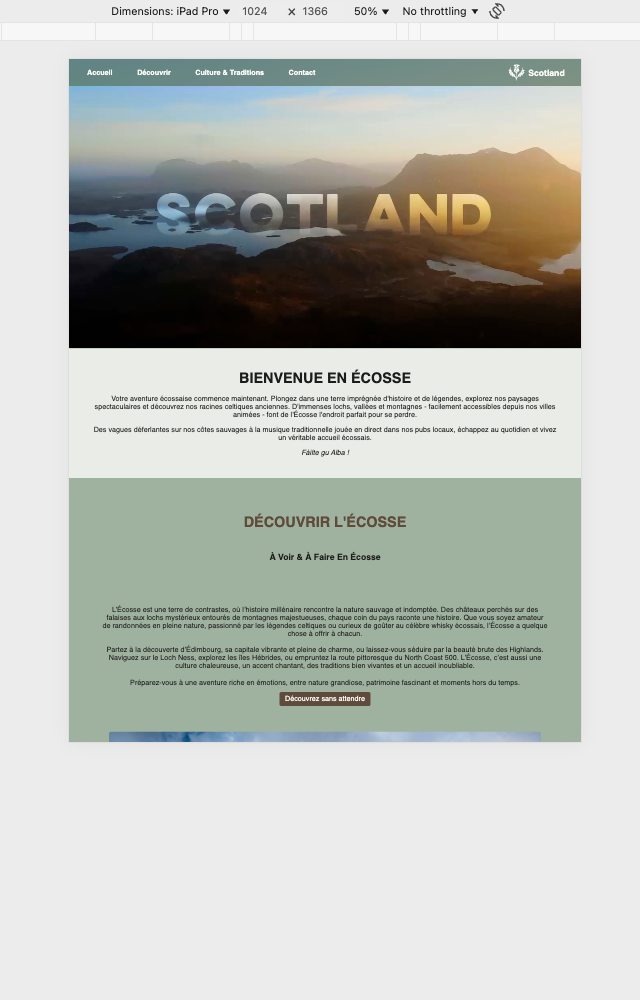
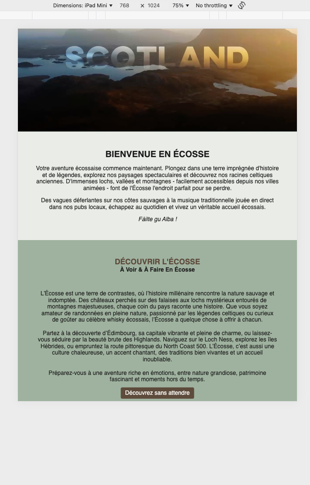
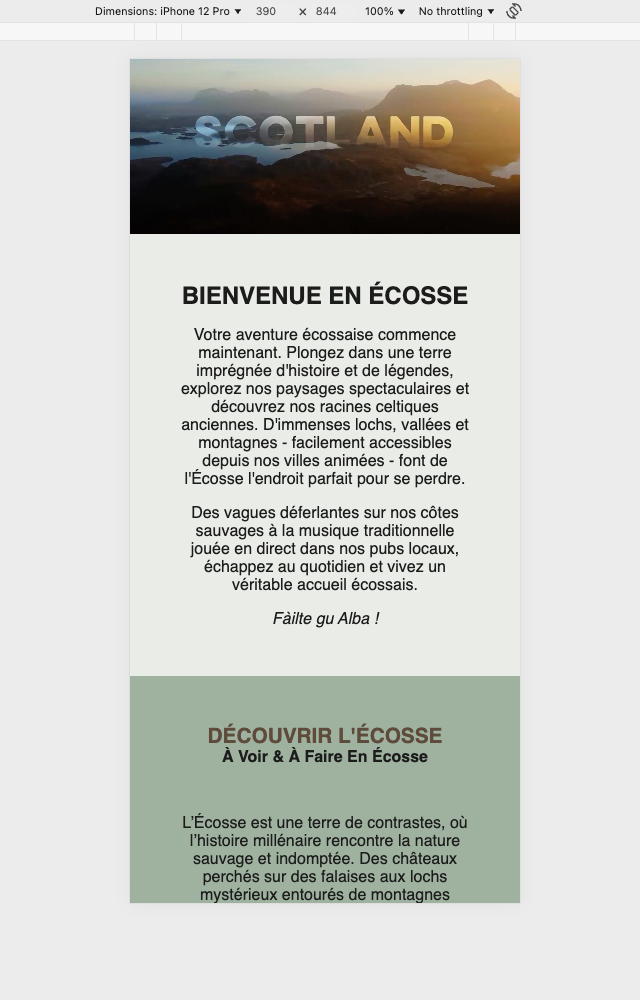
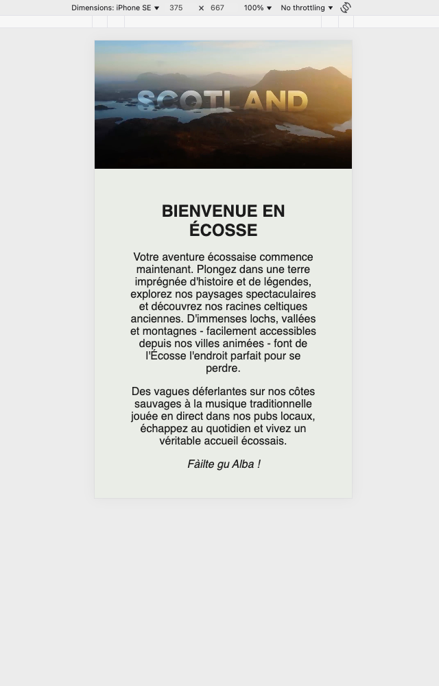

# IPFA BIDA 01 Web Exam

This project is a static and responsive mini-website developed using HTML and CSS as part of the IPFA BIDA 01 exam. It offers an immersive discovery of Scotland through visual and audio content while ensuring a smooth experience on all screen sizes (desktop, tablet, mobile).


## Local Deployment with Docker
This project uses **Docker** and **docker-compose** to run the static site in a container. This ensures identical execution on all machines, without manual server configuration.

### Files Used
-   `.env`: Contains environment variables
-   `Dockerfile`: Defines the Docker image based on a lightweight web server (**Nginx**)
-   `docker-compose.yml`: Orchestrates and launches the container

### Prerequisites
-   [Docker Desktop](https://www.docker.com/products/docker-desktop/) installed
-   `docker-compose` (included with Docker Desktop)

### Run the Site Locally
```bash
# Clone the project
git clone https://github.com/CGREGG001/visit-scotland.git 
# Note: I used "my-user" as in your previous example. Change if "mon-utilisateur" was intended literally.
cd visit-scotland
# Start the container
docker-compose up --build
```
The site will be accessible at:
http://localhost:8080

### To stop the container
```bash
docker-compose down
```

## Site Structure (4 Pages)
1. **Home** – General introduction to the website and Scotland.
2. **Discovery** – Enriched content with images and videos of iconic landscapes.
3. **Culture & Traditions** – Interactive content with audio and descriptions of Scottish customs.
4. **Contact** – Contact form and useful information.

## Technologies Used
- **HTML** for website structure.
- **CSS** (Flexbox, Grid, Media Queries) for layout and responsive design.
- **Nginx**: Web server to handle requests, security, and redirects.
- **Docker**: Containerizing applications for consistent and repeatable deployment.

## Learning Objectives
- Structure a multi-page website using HTML and CSS.
- Integrate multimedia elements (images, videos, audio).
- Design a responsive layout for better accessibility.
- Configure a web server to handle requests, security, and redirects.
- Containerize applications for consistent and reproducible deployment.

---

# Examen Web IPFA BIDA 01

Ce projet est un mini-site web statique et responsive développé en HTML et CSS dans le cadre de l’examen IPFA BIDA 01. Il permet une découverte immersive de l’Écosse à travers des contenus visuels et sonores, tout en garantissant une expérience fluide sur tous les écrans (ordinateurs, tablettes, mobiles).

## Déploiement local avec Docker
Ce projet utilise **Docker** et **docker-compose** pour exécuter le site statique dans un conteneur. Cela garantit une exécution identique sur toutes les machines, sans configuration manuelle du serveur.
### Fichiers utilisés
- `.env` : Contient les variables d’environnement
- `Dockerfile` : Définit l’image Docker à partir d’un serveur web léger (**Nginx**)
- `docker-compose.yml` : Orchestration et lancement du conteneur
### Prérequis
- [Docker Desktop](https://www.docker.com/products/docker-desktop/) installé
- `docker-compose` (inclus avec Docker Desktop)
### Lancer le site en local
```bash
# Cloner le projet
git clone https://github.com/CGREGG001/visit-scotland.git
cd visit-scotland
# Lancer le conteneur
docker-compose up --build
```
Le site sera accessible à l’adresse :
http://localhost:8080

### Pour arrêter le conteneur
```bash
docker-compose down
```

## Structure du site (4 pages)
1. **Accueil** – Présentation générale du site et introduction à l’Écosse.
2. **Découverte** – Page enrichie avec images et vidéos des paysages emblématiques.
3. **Culture et traditions** – Contenus interactifs avec audios et descriptions des coutumes écossaises.
4. **Contact** – Formulaire de contact et informations utiles.

## Technologies utilisées
- **HTML** pour la structure du site.
- **CSS** (Flexbox, Grid, Media Queries) pour la mise en page et le design responsive.
- **Nginx** : Serveur web pour gérer les requêtes, la sécurité et les redirections.
- **Docker** : Conteneurisation des applications pour un déploiement cohérent et reproductible.

## Objectifs pédagogiques
- Structurer un site multi-pages en HTML et CSS.
- Intégrer des éléments multimédias (images, vidéos, audios).
- Concevoir un design adaptatif (responsive) pour une meilleure accessibilité.
- Configurer un serveur web pour gérer les requêtes, la sécurité et les redirections.
- Conteneuriser les applications pour un déploiement cohérent et reproductible.


# Theme Preview

The website automatically adapts to your system’s theme preference:  
light if your system is in light mode, dark if it’s in dark mode.  
No action is required from the user — it works seamlessly.


### Light Mode


---

### Dark Mode


---

# Responsive Design

The website is fully responsive and adapts seamlessly to all screen sizes.  
Below are previews on various devices.


### Desktop



---

### Tablets

**iPad Pro**



**iPad Mini**



---

### Smartphones

**iPhone 12 Pro**



**iPhone SE**

