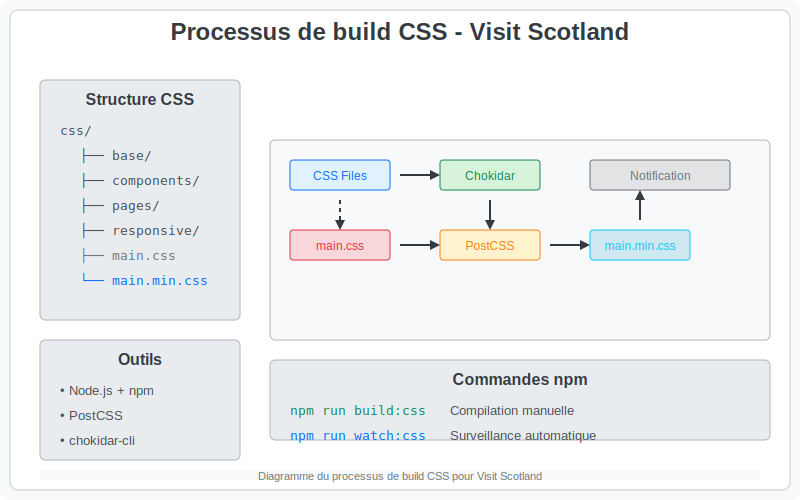

# CSS Build Process

This file documents the automated build process for `main.min.css` in the **Visit Scotland** project.

---

# CSS Build Process

Ce fichier documente le processus de création automatisé de `main.min.css` pour le projet **Visit Scotland**.

---

<details>
    <summary>🇬🇧 English</summary>

## CSS Directory Structure

```
css/
├── base/
├── components/
├── pages/
├── responsive/
├── main.css
└── main.min.css
```

---



---

## Objective

Automate the **merging**, **minification**, and **real-time updating** of the `main.min.css` file, from `main.css` which includes all imports.

---

## Tools Used

- [Node.js](https://nodejs.org) + [npm](https://www.npmjs.com/)
- [PostCSS](https://postcss.org/)
- [chokidar-cli](https://github.com/kimmobrunfeldt/chokidar-cli) for file watching
- [postcss-cli](https://github.com/postcss/postcss-cli)
- [postcss-import](https://github.com/postcss/postcss-import) for handling local `@import` statements
- Custom Node.js notification system (`notify-css.js`)

---

## Installing Dependencies

```bash
npm init -y
npm install --save-dev postcss postcss-cli chokidar-cli postcss-import
```

---

## Files to Add

### `postcss.config.js`
```js
module.exports = {
    plugins: [
        require('postcss-import'),
        require('autoprefixer'),
        require('cssnano')({ preset: 'default' })
    ]
}
```

### `notify-css.js`
```js
const notifier = require('node-notifier');
const { exec } = require('child_process');

exec('npm run build:css', (error, stdout, stderr) => {
    if (error) {
        notifier.notify({
            title: '❌ CSS Compilation Error',
            message: error.message || 'An error occurred while compiling CSS.',
            sound: true,
            timeout: 5
        });
        console.error(stderr);
        return;
    }

    notifier.notify({
        title: 'CSS Compiled',
        message: '✅ main.min.css has been updated.',
        sound: true,
        timeout: 3
    });
    console.log(stdout);
});
```

### `package.json` (scripts)
```json
"scripts": {
  "build:css": "postcss site/css/main.css -o site/css/main.min.css",
  "watch:css": "chokidar 'site/css/**/*.css' -c 'npm run build:css && node site/scripts/notify-css.js'"
},
```

---

## Useful Commands

- Run a manual compilation:
```bash
npm run build:css
```

- Start automatic file watching:
```bash
npm run watch:css
```

---

## Result

- `main.min.css` contains the **final minified CSS**, merged from files locally imported via `@import` (not remote `@import url(...)` statements!).
  - Automatic updates each time a `.css` file is saved in `site/css/`.

</details>

---

## 🇫🇷 Arborescence CSS

```
css/
├── base/
├── components/
├── pages/
├── responsive/
├── main.css
└── main.min.css
```

---


---

## Objectif

Automatiser la **fusion**, la **minification** et la **mise à jour en temps réel** du fichier `main.min.css`, à partir de `main.css` qui regroupe tous les imports.

---

## Outils utilisés

- [Node.js](https://nodejs.org) + [npm](https://www.npmjs.com/)
- [PostCSS](https://postcss.org/)
- [chokidar-cli](https://github.com/kimmobrunfeldt/chokidar-cli) pour la surveillance de fichiers
- [postcss-cli](https://github.com/postcss/postcss-cli)
- [postcss-import](https://github.com/postcss/postcss-import) pour gérer les imports `@import` locaux
- Notification personnalisée en Node.js (`notify-css.js`)

---

## Installation des dépendances

```bash
npm init -y
npm install --save-dev postcss postcss-cli chokidar-cli postcss-import
```

---

## Fichiers à ajouter

### `postcss.config.js`
```js
module.exports = {
    plugins: [
        require('postcss-import'),
        require('autoprefixer'),
        require('cssnano')({ preset: 'default' })
    ]
}
```

### `notify-css.js`
```js
const notifier = require('node-notifier');
const { exec } = require('child_process');

exec('npm run build:css', (error, stdout, stderr) => {
    if (error) {
        notifier.notify({
            title: '❌ CSS Compilation Error',
            message: error.message || 'An error occurred while compiling CSS.',
            sound: true,
            timeout: 5
        });
        console.error(stderr);
        return;
    }

    notifier.notify({
        title: 'CSS Compiled',
        message: '✅ main.min.css has been updated.',
        sound: true,
        timeout: 3
    });
    console.log(stdout);
});
```

### `package.json` (scripts)
```json
"scripts": {
"build:css": "postcss site/css/main.css -o site/css/main.min.css",
"watch:css": "chokidar 'site/css/**/*.css' -c 'npm run build:css && node site/scripts/notify-css.js'"
},
```

---

## Commandes utiles

- Lancer une compilation manuelle :
```bash
npm run build:css
```

- Lancer la surveillance automatique :
```bash
npm run watch:css
```

---

## Résultat

- `main.min.css` contient le **CSS final minifié**, fusionné à partir des fichiers importés localement via `@import` (pas de `@import url(...)` distant !).
- Mise à jour automatique à chaque sauvegarde d’un fichier `.css` dans `site/css/`.
